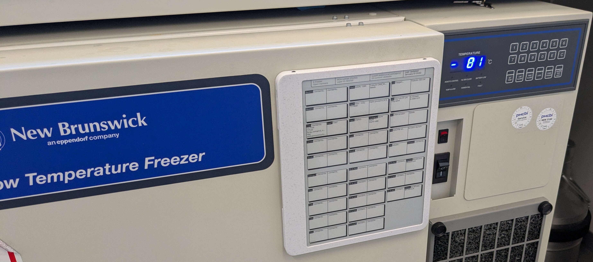

A common situation you find in wetlabs around the world is that there are many samples, but it is not easy to keep track of where they may be in the many freezers. Solutions generally come in two flavours:

1. A crumpled piece of damp printerpaper, covered in unreadable scribbles and crossed-out old sample labels that (allegedly) lists the contents of the freezer.
2. An online system that is well organised, but requires loading a webpage on a prehistoric netbook, setting you back 4 minutes before you finally get the information you need.

This Open Hardware design aims to provide a relatively affordable solution that aims to improve the Freezer organisation experience for those managing their Freezers with some kind of electronic system. It displays the fridge contents on an Electronic Paper Display (E-ink), and updates itself. 



This way you not only have the advantage of having a well organised online freezer system, but **also** the advantage of having that information as **immediately available** as that outdated unreadable piece of paper that used to be on the fridge. Nobody wants a crusty piece of paper with hieroglyphics, and nobody wants to spend 3 minutes on the world's slowest computer just to find out where sample X is supposed to be stored. This solution keeps the best of both worlds.

### Hardware & Assembly


The hardware design files, [BOM](enclosure/BOM_freezer-display-assembly.csv) and assembly instructions can be found in the [enclosure](enclosure/) directory. 

Note that the device is not battery powered. 

### Software & Flashing


The code/firmware for this project can be found in the [esp](esp/) directory. The project uses the Espressif development toolchain to manage the c/c++ firmware. There you will also find instructions on the setup and on how to flash the device.

### Contributing

If you want to modify the project, I strongly suggest you use the git hooks provided in the .githooks directory. They will ensure you will always commit the most recent version of FreeCAD files and derivative items (step files, thumbnails).

```bash
git config --local core.hooksPath .githooks/
```

### Some possible future upgrades

The chosen hardware has a room for future improvements and additional functionality. In no particular order, these are some low-hanging fruit improvements.

* Add small battery, and optimise for low-power use.
* Landscape/portrait mode switching and sensor to sense this directly
* Some capacitive buttons (no ingress point, can use capacitive button pins on ESP32)
* Proper weather (or in this case Lab Goo™) sealing on the USB port
* NFC functionality to allow users to update the panel with a tap of their phone/lab device 

### Funding & Acknowledgements

This project was developed for and funded by the lab of Marileen Dogterom at the TU Delft.

Contributors:
* Nemo Andrea 

# Nix related

Use https://github.com/mirrexagon/nixpkgs-esp-dev for a shell that will enable development.
