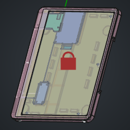
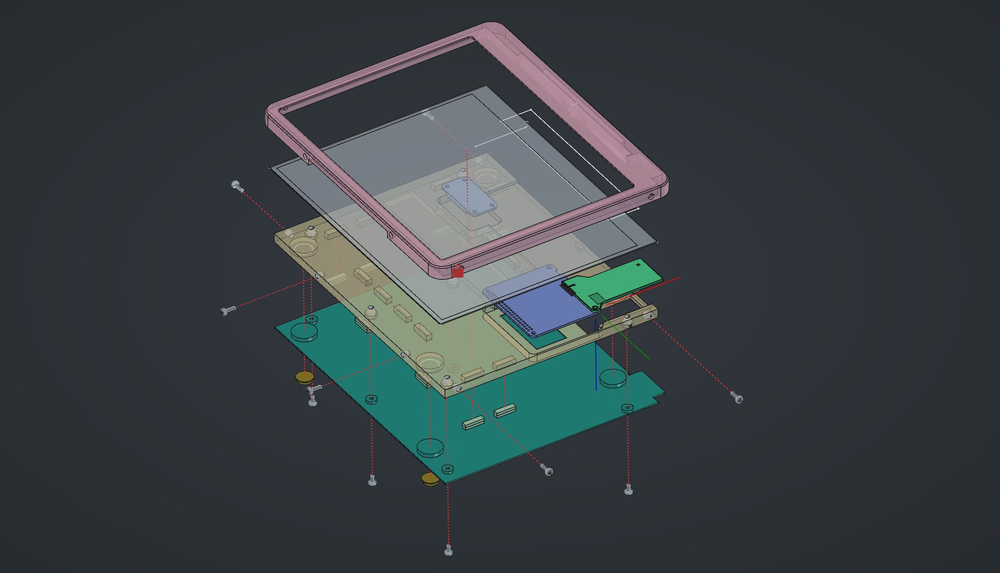

# E-Freezer Hardware Design

The Hardware design for the E-freezer system is built around Waveshare's 10.3 inch high resolution E-ink panel. This panel is paired up with an ESP32-S3, connected through a shim PCB. This is all held together in an easy to 3D print enclosure that is designed to be as thin as possible. The display is held onto the target surface through embedded magnets.

See the [BOM](BOM_freezer-display-assembly.csv) for details on the parts, pricing and where to source them. For a quick image preview of the different elements of the assembly, you can check the [thumbnails](.thumbnails/) diretory.

To assemble the system, consult the [assembly instructions](assembly/README.md).

### Points of improvement

* Replacing the heated inserts with dedicated polymer/plastic screws would simplify the assembly
* The IT8951 driver chip board is not a very convenient form factor for the system. Replacing it with a more compact board, or at least one that is not difficult to desolder properly would be a massive improvement in assembly convenience.

### Tooling

Files were created using FreeCAD 1.1. To properly view the main assembly, you will also need to install the `Assembly4` workbench from the FreeCAD Addon Manager.

### BOM organisation

The BOM for the assembly is dynamically generated in FreeCAD. For this to work, custom `properties` [have to be added to each part](https://www.youtube.com/watch?v=jkNYAvFhUj8). For this project, the following *new* properties will be rendered in the BOM if included.

* `Description`: Few-word description of the part
* `Manufacturer`: self-explanatory.
* `ManufacturerNr`: the part number the manufacturer uses
* `Supplier`: If the supplier is not the manufacturer, then specify the supplier here. Otherwise, omit property.
* `SupplierNr`: self-explanatory. Omit if `Supplier` was omitted.
* `PriceEx`: the price in Euro excluding tax or shipping. Can be approximate.
* `VariantID`: if part is a component in an optional module, it should have an identifier that can be grouped in the BOM. Omit if part of the base system.
* `Comment`: optional further comments that you want to show up in the BOM. May be related to the part, its manufacturing or use, or about the sourcing of the part.

### Acknowledgements

The Unexpected Maker ESP32-S3 ProS3 STEP model was taken from the official repository. This repository [is also a submodule in the pcb directory](../pcb/esp32s3).

[^1]: This can be through laser engraving or through the application of stickers or waterslide decals. An example for such a design can be found in [the assets subdirectory](assets/enclosure-decal.svg).