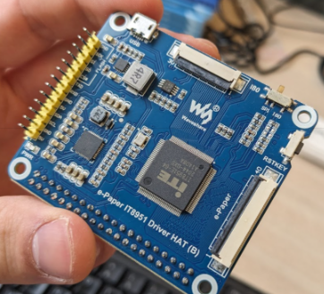
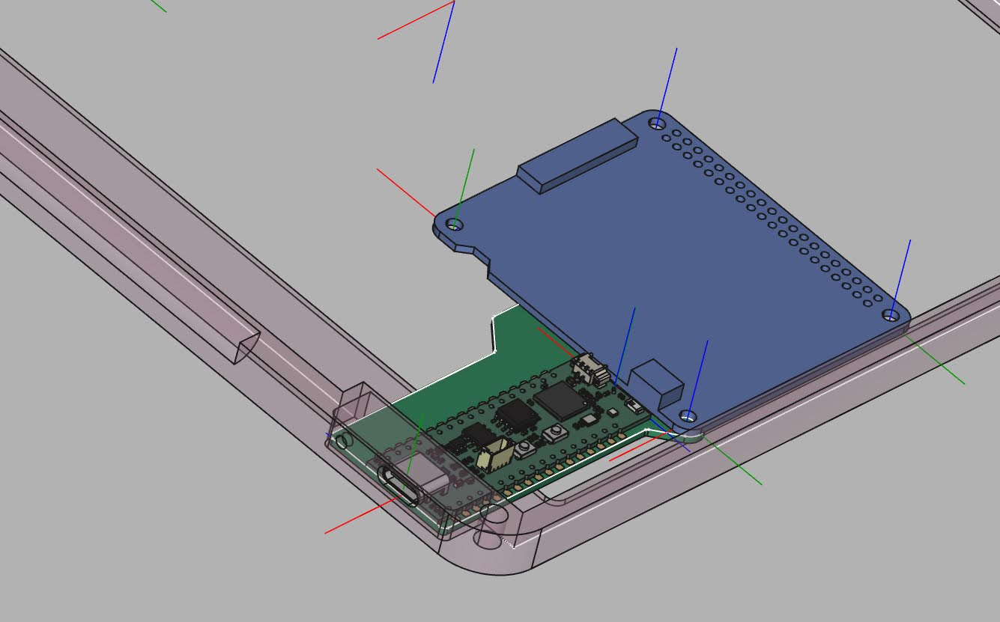
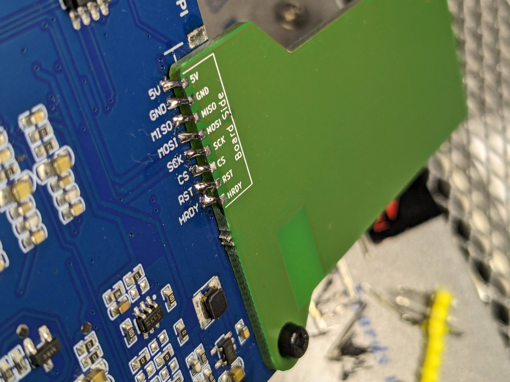
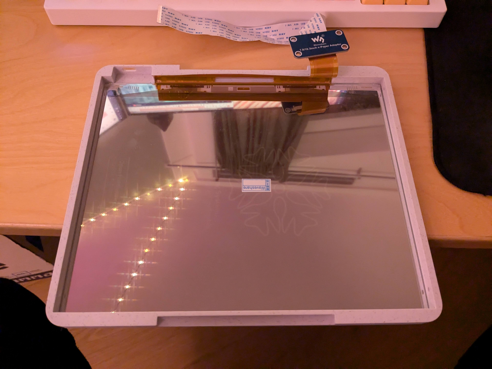
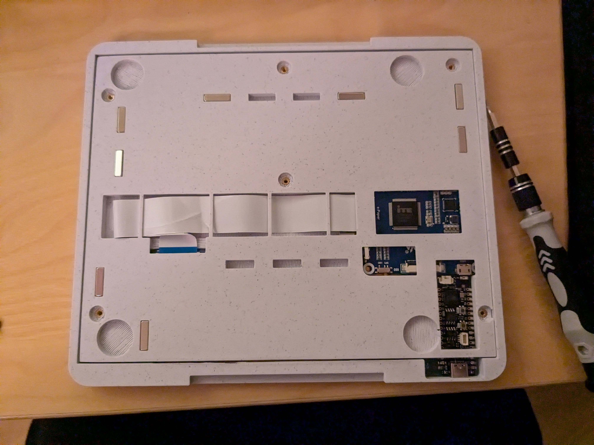
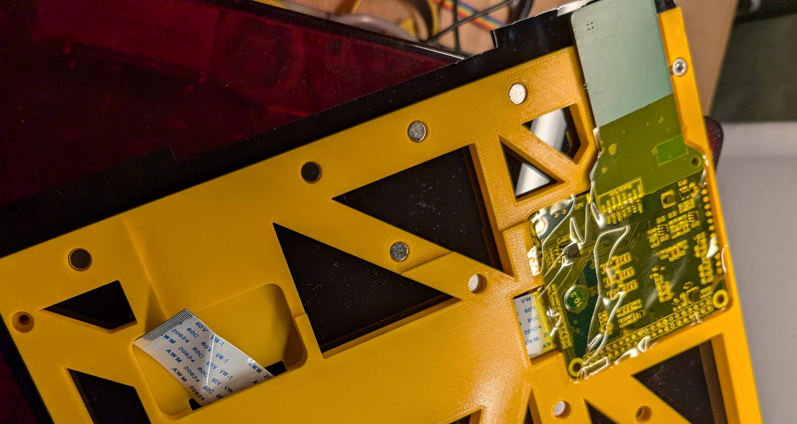
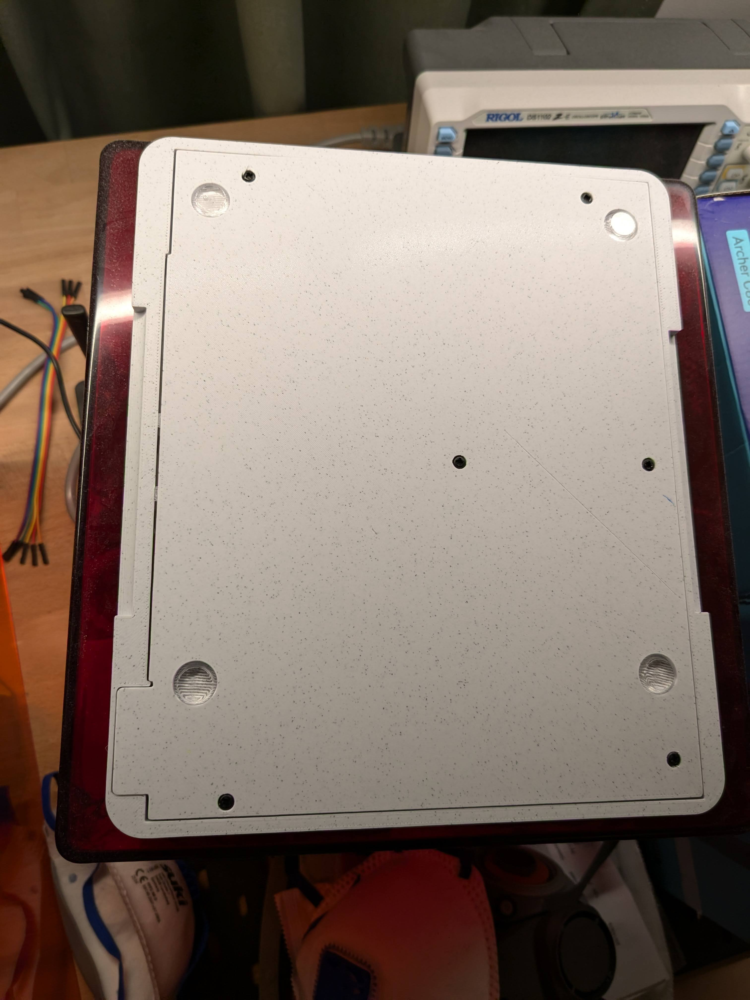

# Assembly Guide

## Required tools

* Infared/hot air solderin station
* Soldering Setup
* Screwdriver (for philips-type screws, or whatever M2.5 screws you ordered)
* Safety goggles
* [optional] kapton tape
* [optional] Painters tape or other thin tape or glue

## Steps

Before the system can be assembled, we must first remove some of the headers from the IT8951 driver board. This can be very tricky, as the headers are large elements that require heating of a large area of the board. An infared heater or hot air station is absolutely required. The (1) yellow header array (visible in image below), the (2) raspberry-pi-compatible header (on the underside of the board in image below) and (3) a connector (on the underside of the board in the image below) must be removed.

The Pro-S3 board must then be soldered onto the shim PCB as shown in the FreeCAD file and the image below:

The IT8951 driver board must also be soldered onto the shim PCB. This can be tricky, as the contact area is small. To make this easier, **temporarily** screw/clamp the boards together using the aligned circular hole in the corners of both boards. make sure to remove the clamping source afterwards. It should look something like this (minus the solder bridging).

> [!TIP]
> At this point, I would flash the firmware and see if the system behaves as expected before continuing assembly.

In the 3D printed parts, insert the threaded inserts with a soldering iron. Be careful not to tilt them too far out of axis; the tolerances are not critical, but it is very easy to tilt the insert due to the limited amount of material around each insert point.

Now we can just assemble the whole thing. 

> [!WARNING]
> The Flexible PCB that is coming off the display is fragile. Be careful when handling or bending it.

We want to start by placing the (fragile) display into the outer frame. Note that the display has a protective cover film -- you may want to remove it. First insert the part of the display into the side of the E-freezer that is furthest from the charging port. Then lower it fully into the slot, carefully bending the Flex PCB

Next, you will want to disconnect the write ribbon cable from the IT8951 driver board, and route it through the 3D-printed inner frame. You may have to bend the cable at an uncomfortable angle. Try to maximise the bending radii. Once the ribbon cable is routed, reconnect the IT8951 board. This may all be a bit tricky and require some dexterity as the cables are short, and you will want to pay attention to the Flex PCB of the display. It should look something like this when done correctly:

> [!TIP]
> If you want to be super safe, you can cover the side of the IT8951 board that contacts the display with some Kapton Tape. 
> That way it will not scratch the display or cause shorts[^2]. It also helps keep things in place as you try to fold it all together. Below an example with an older revision of the internal frame.
> 

> [!CAUTION]
> Always wear safety goggles when handling neodymium (or strong) magnets.

At this stage, the magnets can be inserted. Make sure to have all their polarities point in the same way. Be careful with the magnets; they will want to shoot out of the pockets. Adding some thin painters tape or other way to keep them in the pocket is a good idea.

After adding the magnets, you can screw everything together and add the anti-slip pads to the back-panel.

To cosmetically finish off the part, or to provide some instructions and guidance for the user, you could apply text to the 3D printed parts.[^1]

[^1]: This can be through laser engraving or through the application of stickers or waterslide decals. An example for such a design can be found in [the assets subdirectory](../assets/enclosure-decal.svg).
[^2]: I don't think shorting is very likely, but with kapton tape it will be safe even under heavy abuse.
