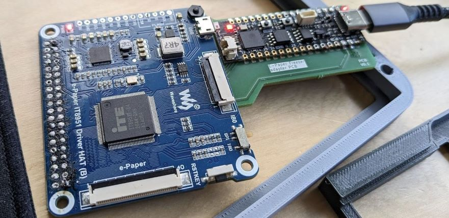
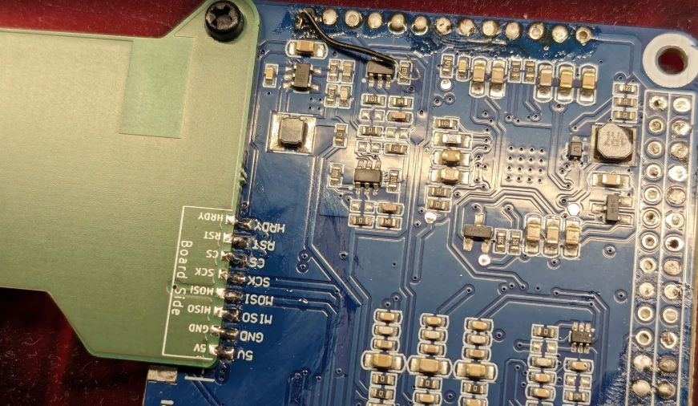

# Shim PCB

The PCB for the project is a simple shim PCB, i.e. it merely serves to connect the two boards, functioning as a low-profile connector. Since we are severely constrained in terms of space, and we don't have control over the connectors on the boards that we are connecting, this seems like the best solution.

To assemble the PCB stack, you will need to remove some headers from the Waveshare board:

1. the 13 pin single row header
2. The 40-pin female Raspberry Pi-compatible header.
3. The 6-pin connector that is used for non-raspberry boards. 

The shim PCB will solder to the contact of connector 3. 

> [!TIP]
> You can temporarily add a M2.5 bolt and nut to keep the boards together and in the correct orientation during soldering. Note that the bolt will need to be removed in the final assembly.

### PCB Manufacturing notes

I had my boards manufactured at Aisler. Any board manufacturer that can do castellated edges should be fine. I would opt for a standard thickness. 

> [!IMPORTANT]
> The board must be manufactured with castellated edges. 